<div align="center">
  
  
  <h1>Campus QuickSplit</h1>
  
  <p>
    
    
    
    
  </p>

  <p>
    <a href="https://drive.google.com/file/d/1HqMx2LauwsbZ86wX8gXiYC9CDCHMkocK/view?usp=sharing">
      
    </a>
  </p>
</div>

## Overview

A frictionless, **offline-first** peer expense tracker built entirely in Flutter. 

Students frequently manage shared group expenses where amounts are split unevenly among varying group members. Examples include **daily auto rides**, **Group subscriptions (like Spotify, Netflix, etc.)**, **food bills**, and **printout costs**.

Existing expense-splitting platforms introduce excessive friction through mandatory phone number signups, slow cloud sync, network dependency, and complex onboarding for transient, ad-hoc transactions. Campus QuickSplit completely eliminates this friction. It operates entirely locally on your device using `sqflite`, ensuring zero latency, absolute privacy, and requiring absolutely no internet connection to log everyday debts.

---

## Tech Stack & Packages

* **Core:** Flutter, Dart, SQLite (`sqflite`), State Management (`provider`), Unique IDs (`uuid`).
* **P2P & Sharing:** Android Nearby (`nearby_connections`), QR Generation (`qr_flutter`), Camera Scanner (`mobile_scanner`), File Sharing (`share_plus`).
* **UI & Analytics:** Charting (`fl_chart`), Micro-interactions (`flutter_animate`), Typography (`google_fonts`).
* **System Integrations:** OS Alarms (`flutter_local_notifications`, `timezone`), Permissions (`permission_handler`), Storage Access (`file_picker`).

---

## Application Previews

### Main Hub & Identity
<table align="center">
  <tr>
    <th align="center"><div align="center">Dashboard (Light)</div></th>
    <th align="center"><div align="center">Dashboard (Dark)</div></th>
    <th align="center"><div align="center">User Profile</div></th>
    <th align="center"><div align="center">Groups List</div></th>
  </tr>
  <tr>
    <td align="center" width="25%"><div align="center">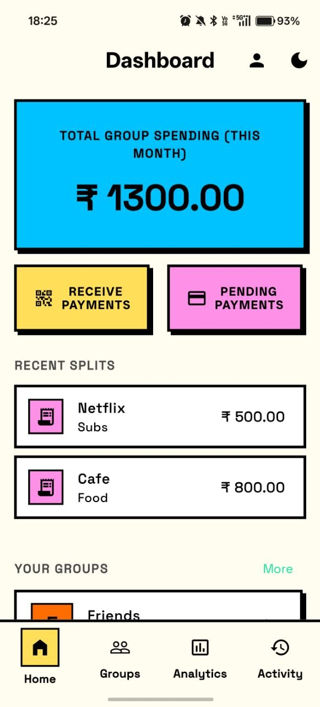</div></td>
    <td align="center" width="25%"><div align="center">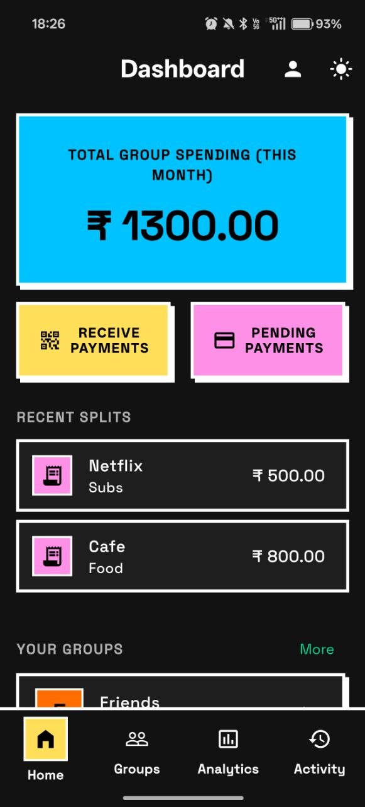</div></td>
    <td align="center" width="25%"><div align="center">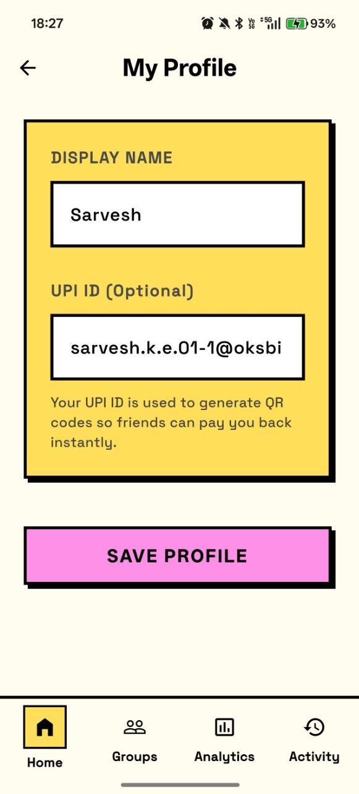</div></td>
    <td align="center" width="25%"><div align="center">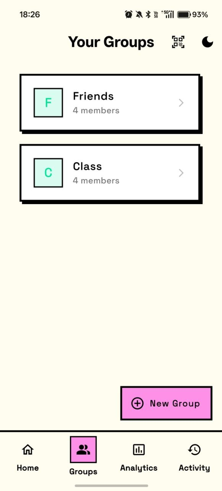</div></td>
  </tr>
  <tr>
    <td align="center"><div align="center">Overview of group expenses and pending payouts.</div></td>
    <td align="center"><div align="center">Dark mode interface.</div></td>
    <td align="center"><div align="center">User profile settings with UPI configuration.</div></td>
    <td align="center"><div align="center">List of all active expense groups.</div></td>
  </tr>
</table>

### Expense Splitting
<table align="center">
  <tr>
    <th align="center"><div align="center">Manage Members</div></th>
    <th align="center"><div align="center">Multi-Payer Support</div></th>
    <th align="center"><div align="center">Split Mode Selection</div></th>
    <th align="center"><div align="center">Group Balances</div></th>
  </tr>
  <tr>
    <td align="center" width="25%"><div align="center">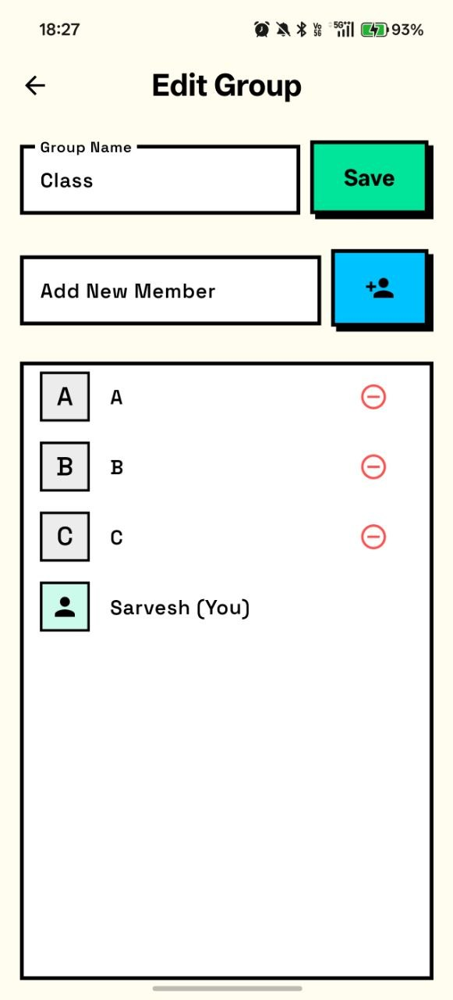</div></td>
    <td align="center" width="25%"><div align="center">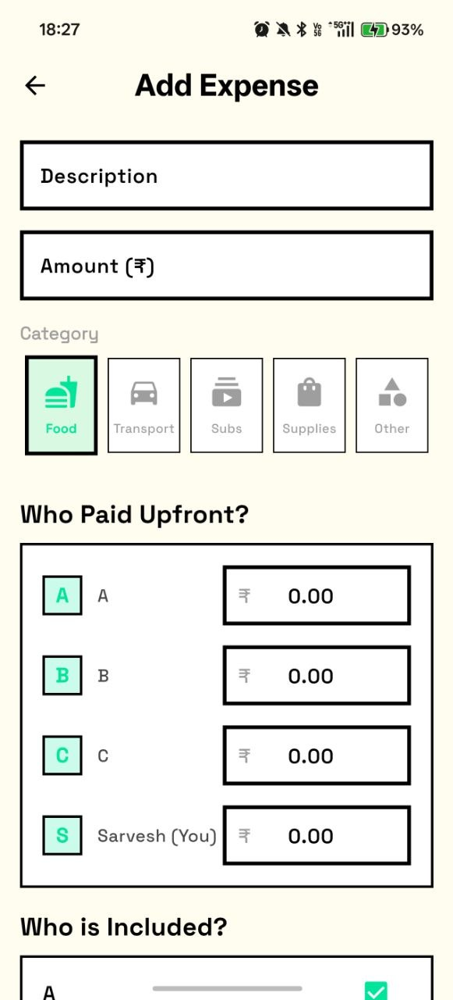</div></td>
    <td align="center" width="25%"><div align="center">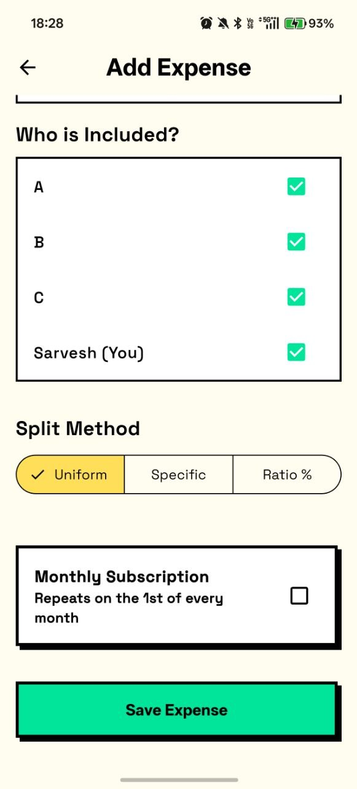</div></td>
    <td align="center" width="25%"><div align="center">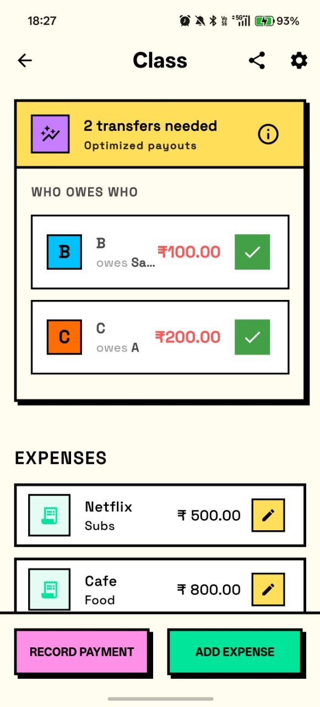</div></td>
  </tr>
  <tr>
    <td align="center"><div align="center">Manage group members.</div></td>
    <td align="center"><div align="center">Support for multiple people paying a single bill.</div></td>
    <td align="center"><div align="center">Multiple splitting methods (Uniform, Exact, Ratio).</div></td>
    <td align="center"><div align="center">Group dashboard showing balances and expenses.</div></td>
  </tr>
</table>

### Payments & Offline Sync
<table align="center">
  <tr>
    <th align="center"><div align="center">Pending Payouts</div></th>
    <th align="center"><div align="center">Instant UPI Payments</div></th>
    <th align="center"><div align="center">Offline QR Sync</div></th>
    <th align="center"><div align="center">Activity Ledger</div></th>
  </tr>
  <tr>
    <td align="center" width="25%"><div align="center">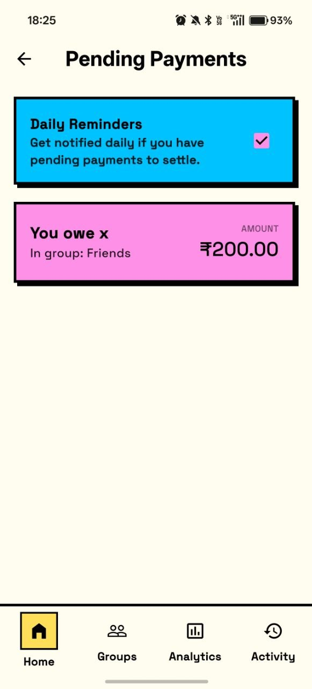</div></td>
    <td align="center" width="25%"><div align="center">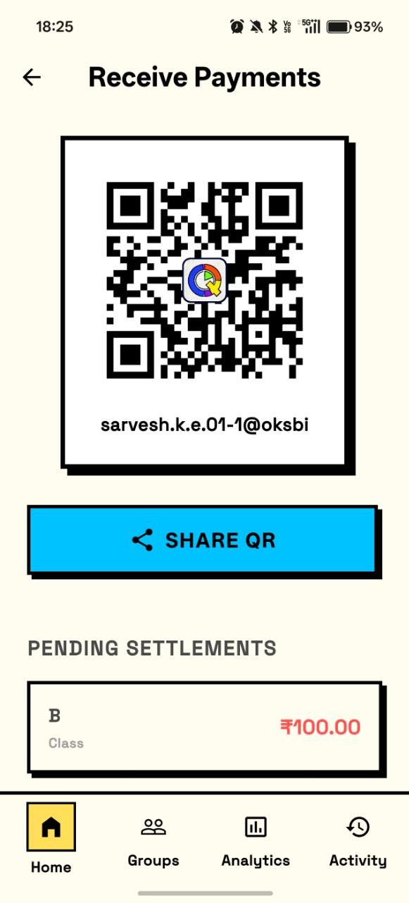</div></td>
    <td align="center" width="25%"><div align="center">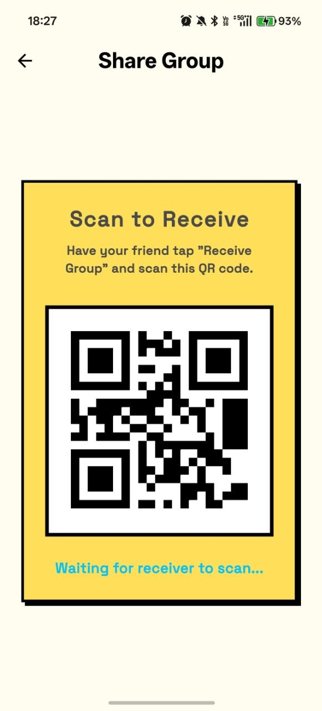</div></td>
    <td align="center" width="25%"><div align="center">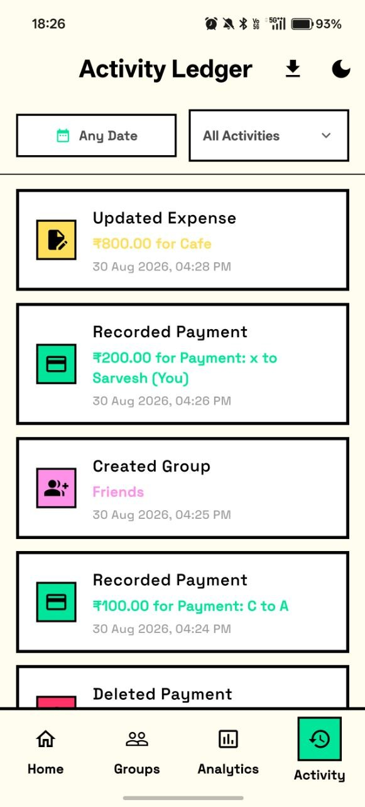</div></td>
  </tr>
  <tr>
    <td align="center"><div align="center">List of all pending payouts.</div></td>
    <td align="center"><div align="center">Scan to pay via UPI QR code.</div></td>
    <td align="center"><div align="center">Share group data offline via QR code.</div></td>
    <td align="center"><div align="center">Complete history of all app actions.</div></td>
  </tr>
</table>

### Analytics & Optimization
<table align="center">
  <tr>
    <th align="center"><div align="center">Raw Group Debts</div></th>
    <th align="center"><div align="center">Smart Optimized Debts</div></th>
    <th align="center"><div align="center">Spend Heatmap</div></th>
    <th align="center"><div align="center">Category Insights</div></th>
  </tr>
  <tr>
    <td align="center" width="25%"><div align="center">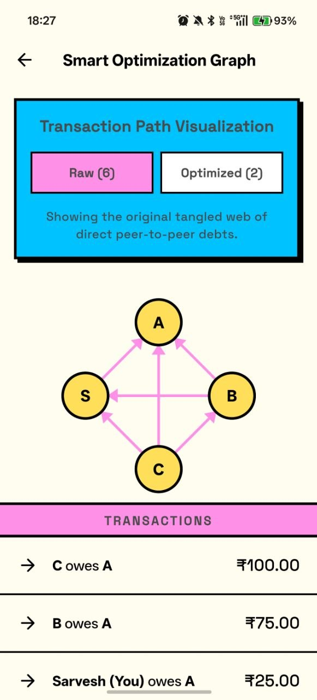</div></td>
    <td align="center" width="25%"><div align="center">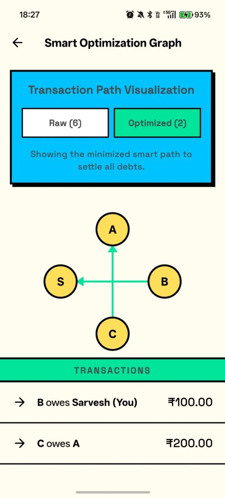</div></td>
    <td align="center" width="25%"><div align="center">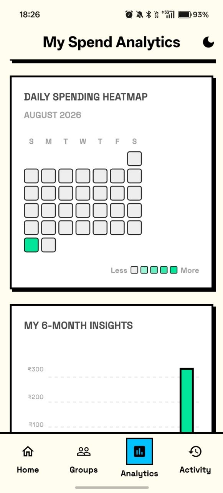</div></td>
    <td align="center" width="25%"><div align="center">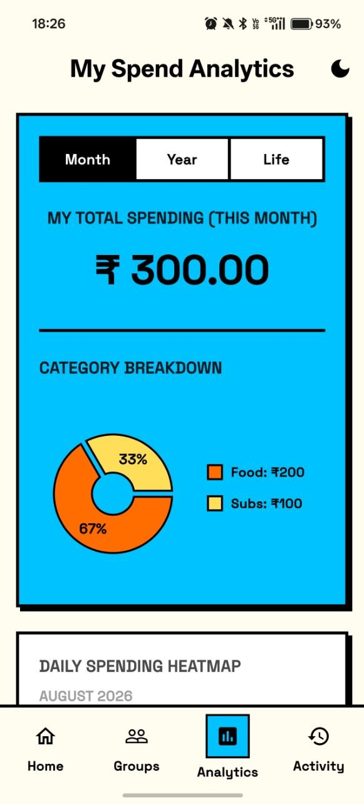</div></td>
  </tr>
  <tr>
    <td align="center"><div align="center">Original unoptimized debt graph.</div></td>
    <td align="center"><div align="center">Optimized minimum transaction graph.</div></td>
    <td align="center"><div align="center">Daily spending heatmap.</div></td>
    <td align="center"><div align="center">Spending breakdown by category.</div></td>
  </tr>
</table>

---

## Key Features

* **Group & Expense Management:** Seamlessly create dedicated groups for trips, roommates, or subscriptions. Track daily shared costs, individual payments, and multi-payer scenarios instantly on your local device.
* **Smart Debt Optimization:** A mathematically rigorous dynamic greedy algorithm operates behind the scenes to simplify chaotic group debts, reducing them to the absolute minimum number of direct peer-to-peer transfers.
* **Instant UPI Payments:** Settle up seamlessly. The app generates dynamic UPI QR codes that automatically embed the exact fractional debt amount and payee details. The payer simply scans this code with their preferred UPI app (like GPay or PhonePe) to instantly complete the transaction.
* **Offline-First P2P Sync (Nearby Connections & QR):** Share your ledger completely offline. The app serializes entire nested SQLite databases into compressed JSON payloads. Share small groups via instantly scannable **QR Codes** (using `mobile_scanner`), or securely transfer massive datasets to friends via Bluetooth using **Android Nearby Connections**.
* **Audit History & CSV Exports:** Maintain total financial transparency. Every single addition, edit, or deletion is tracked in an immutable, timestamped Activity Log with category icons. You can also export your global **Activity Log to a clean CSV file** for spreadsheet analysis.
* **Input Sanitization:** Strict validation logic prevents empty fields, negative amounts, or invalid group sizes, ensuring flawless mathematical execution.
* **Transactional Safety:** Features intuitive swipe-to-delete functionality with undo support and immediate, reactive balance updates.
* **Granular Splitting Modes:** Divide bills precisely how you need to:
  * *Uniform:* Even splits with precise handling for leftover decimal remainders.
  * *Specific Value:* Manual amount assignments with real-time tracking of unallocated totals.
  * *Ratio-Based:* Percentage-driven splitting verified against a 100% cap.
* **Multi-Payer Support:** Handles complex massive bills where multiple people chip in upfront (e.g., Alice pays ₹600, Bob pays ₹400 for a shared restaurant bill). The backend engine automatically tallies who paid what against who *should* have paid, instantly resolving the exact fractional net debts for every participant.
* **Local Notifications:** Daily background alarms trigger directly from the OS to remind you of pending outgoing payments you owe—requiring absolutely zero cloud push-servers.
* **Spend Analytics:** Visualize your cash flow with custom-drawn daily GitHub-style heatmaps, categorized monthly pie charts, and historical 6-month bar graphs providing deep monthly insights.
* **Aesthetic Customization:** System-wide Light and Dark mode support that automatically saves your user preferences.

---

## Rigorous Testing & Quality Assurance

To guarantee mathematical precision and robust data handling, Campus QuickSplit is backed by an advanced suite of automated feature tests:
* **Graph Reduction Validation:** Mathematically proves that the NP-hard greedy algorithm accurately shatters complex circular debt chains into the absolute minimum number of peer-to-peer transactions.
* **Floating-Point Precision Testing:** Prevents "ghost pennies" by aggressively filtering out microscopic floating-point drifts in uneven division, ensuring users never owe fractions of a cent.
* **Payments Offset Verification:** Ensures that unoptimized "raw" group debt instantly processes and offsets partial reimbursements correctly.
* **Data Integrity & Serialization:** Proves via deep JSON injection testing that no UUIDs, usernames, or fractional values are lost during P2P offline data transfers.
* **Timezone Boundary Resistance:** Simulates transactions at extreme midnight edges to ensure expenses fall flawlessly into the correct local calendar day for analytics heatmaps.

---

## System Architecture

Campus QuickSplit is built on a clean, decoupled **offline-first** architecture. The application is divided into three primary layers, ensuring that the user interface remains fast and responsive while complex calculations and data management run safely in the background.

### High-Level Architecture Diagram

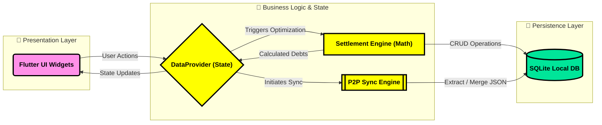

### 1. Presentation & State Layer
The UI is strictly separated from the backend logic. It actively listens to a central `DataProvider` using the **Provider** pattern. When a user adds an expense, the UI simply fires an event to the Provider, which handles the business logic and updates the local state. The UI instantly reacts and redraws only the necessary widgets.

### 2. Core Business Logic (The Settlement Engine)
Instead of putting calculation logic in the UI, all debt resolution happens in a dedicated pure-Dart service. When expenses are logged, the **Settlement Engine** processes the raw transactions, calculates net balances, and runs a mathematical graph-reduction algorithm to minimize the total number of peer-to-peer payouts. 

### 3. Local-First Persistence (`sqflite`)
Because the app is entirely server-free, the local SQLite database acts as the absolute master source of truth. It stores heavily relational data (Users, Groups, Expenses, Activity Logs) natively on the device, guaranteeing instant load times and absolute data privacy.

### 4. Peer-to-Peer Networking (Offline Sync)
To share group ledgers without the cloud, the app features a custom P2P synchronization engine. It serializes the complex SQLite relational trees into lightweight JSON payloads. These payloads are then transmitted locally via **QR Codes** (for quick scans) or **Android Nearby Connections** (for heavy, multi-group transfers over Bluetooth/WiFi-Direct), where the receiving device cleanly merges the data into its own database.

### Codebase Structure

The project follows a modular, feature-separated directory structure to ensure the `UI`, `State`, and `Logic` remain strictly decoupled:

```text
lib/
├── main.dart               # App entry point & Provider initialization
├── router.dart             # GoRouter configuration & deep linking
├── models/                 # Pure Dart data classes (Expense, Group, User)
├── providers/              # State Management (DataProvider for UI reactivity)
├── screens/                # UI Layer (Dashboard, Activity Log, Group Details)
├── services/               # Core Logic Layer (Backend without the cloud)
│   ├── database_service.dart     # SQLite CRUD operations
│   ├── settlement_service.dart   # Graph-reduction math algorithms
│   └── p2p_sync_service.dart     # Offline Nearby/QR data transfer
├── theme/                  # Neo-Brutalist design tokens (Colors, Typography)
└── widgets/                # Reusable UI components (Heatmap, Custom Buttons)
```

---

## How to Build & Run

### Prerequisites
* Flutter SDK (latest stable release)
* A physical Android/iOS device (highly recommended for testing hardware-dependent features like Camera QR scanning and Bluetooth Nearby Connections).

### Installation
1. Clone or download this repository.
2. Initialize the project dependencies:
   ```bash
   flutter pub get
   ```
3. Ensure you have the required permissions configured in your `AndroidManifest.xml` (the provided file already includes necessary permissions for Exact Alarms and Nearby Connections).
4. Run the app:
   ```bash
   flutter run
   ```
